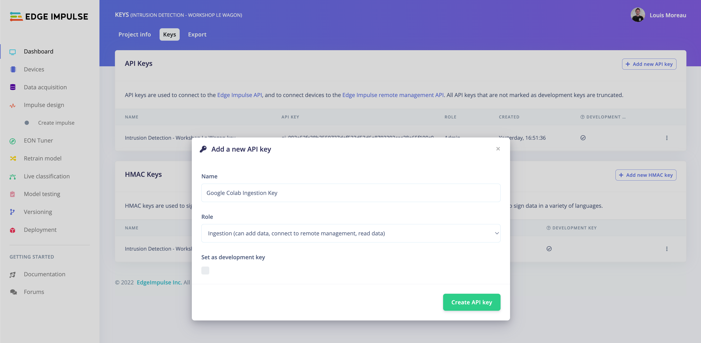
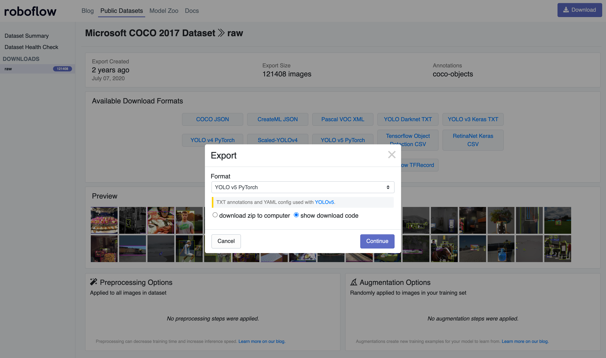
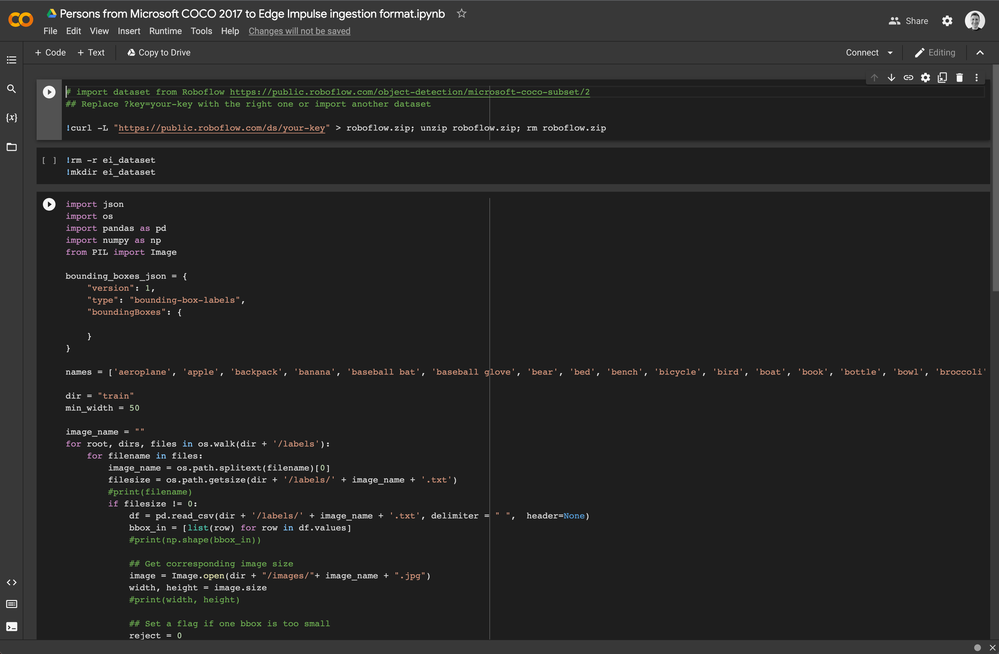
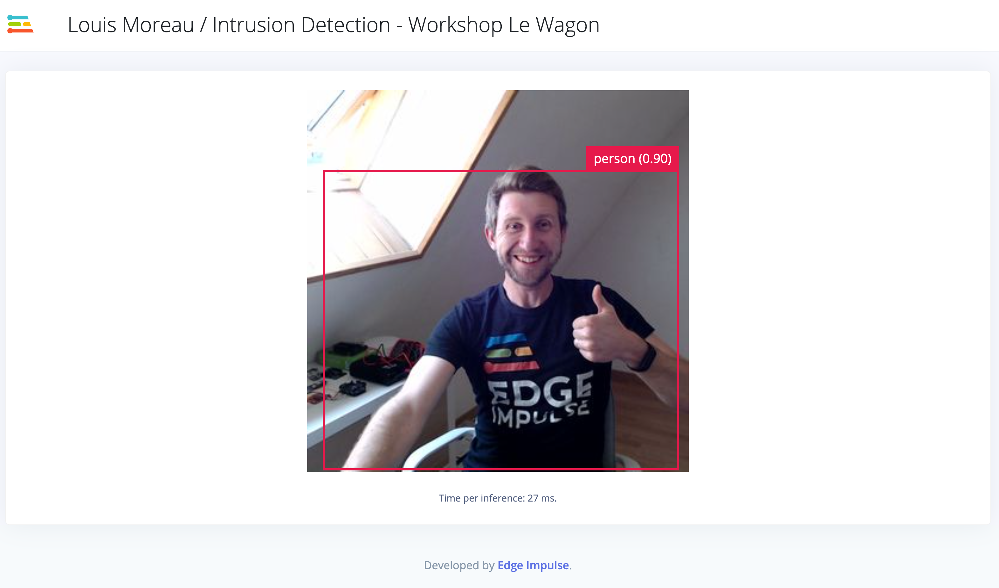
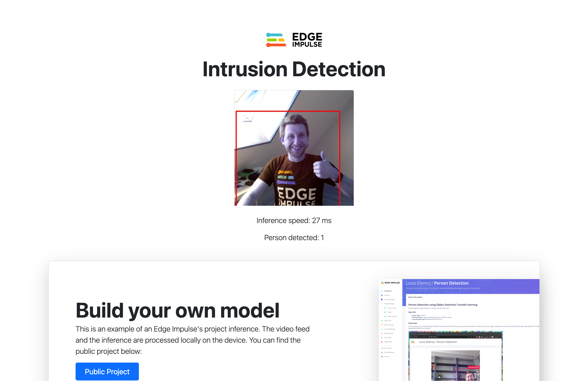

# Intrusion Detection Workshop


## Edge Impulse Public Project

[https://studio.edgeimpulse.com/public/40479/latest](https://studio.edgeimpulse.com/public/40479/latest)

## Build your dataset

### Collecting your own images

To collect your own device, you can use your mobile phone by going to the **Devices** tab and click on **+ Connect a new device**. Select **Use your mobile phone**

### Bounding Boxes format

If you want to upload data that already contains bounding boxes, the uploader can label the data for you as it uploads it. In order to do this, all you need is to create a bounding_boxes.labels file **in the same folder as your image files**. The contents of this file are formatted as JSON with the following structure:

```
{
    "version": 1,
    "type": "bounding-box-labels",
    "boundingBoxes": {
        "mypicture.jpg": [{
            "label": "person",
            "x": 119,
            "y": 64,
            "width": 206,
            "height": 291
        }, {
            "label": "person",
            "x": 377,
            "y": 270,
            "width": 158,
            "height": 165
        }]
    }
}
```

### Use Subset of MS COCO 2017

For this project, we have used a subset of the public MS COCO 2017 dataset.

You can find here a Google Colab link that downloads the dataset on Google Servers, extract the **Person** images and bounding boxes to Edge Impulse format and upload it to your Edge Impulse project: [Google Colab link](https://colab.research.google.com/drive/16zg2WU5eY24WBBU6o-siBLQmQBo7pCV-?usp=sharing).

You will need:

- To create an Edge Impulse ingestion API key for your project:

- To create an account on Roboflow to download the public dataset using the *Yolo v5 PyTorch* format:

- To execute the [Google Colab notebook](https://colab.research.google.com/drive/16zg2WU5eY24WBBU6o-siBLQmQBo7pCV-?usp=sharing):



## Build your impulse

You can find a full tutorial to build an Object Detection machine learning pipeline on Edge Impulse documentation website: [Detect objects with bounding boxes](https://docs.edgeimpulse.com/docs/tutorials/object-detection)

There is also a video available:

[](https://www.youtube.com/watch?v=dY3OSiJyne0)

## Run the inference on a Linux or MacOS machine

To run the inference on your device, we will see two different methods:

- Edge Impulse Linux CLI to verify that your model is working
- Edge Impulse Python SDK to customize your application

### Edge Impulse Linux CLI

To install the Edge Impulse Linux CLI, you will need NodeJS v14 or higher and `edge-impulse-linux` npm package. See our [Edge Impulse for Linux](https://docs.edgeimpulse.com/docs/edge-impulse-for-linux/edge-impulse-for-linux) guide to install the CLI on your device.

Once installed, just run:

```
edge-impulse-linux-runner --clean
```

Follow the prompt, it will build in Edge Impulse servers your model according to your operating system and download the binary for you:

```
luisomoreau@Louiss-MacBook-Pro ~ % edge-impulse-linux-runner --clean
Edge Impulse Linux runner v1.3.1
? What is your user name or e-mail address (edgeimpulse.com)? louis
? What is your password? [hidden]

? From which project do you want to load the model? Louis Moreau / Intrusion Det
ection - Workshop Le Wagon
[RUN] Downloading model...
[BLD] Created build job with ID 2845183
[BLD] Writing templates...
[BLD] Scheduling job in cluster...
[BLD] Job started
[BLD] Exporting TensorFlow Lite model...
[BLD] Exporting TensorFlow Lite model OK
[BLD] 
[BLD] Removing clutter...
[BLD] Removing clutter OK
[BLD] 
[BLD] Copying output...
[BLD] Copying output OK
[BLD] 
[BLD] Scheduling job in cluster...
[BLD] Job started
[BLD] Building binary...
[BLD] o64-clang++ -MD -Wall -g -Wno-strict-aliasing -I. -Isource 
...
[BLD] Building binary OK
[RUN] Downloading model OK
[RUN] Stored model version in /Users/luisomoreau/.ei-linux-runner/models/105817/v1/model.eim
[RUN] Starting the image classifier for Louis Moreau / Intrusion Detection - Workshop Le Wagon (v1)
[RUN] Parameters image size 320x320 px (3 channels) classes [ 'person' ]
? Select a camera HD Pro Webcam C920
[RUN] Using camera HD Pro Webcam C920 starting...
[RUN] Connected to camera

Want to see a feed of the camera and live classification in your browser? Go to http://192.168.1.196:4912

boundingBoxes 37ms. [{"height":171,"label":"person","value":0.9868184924125671,"width":236,"x":8,"y":148},{"height":142,"label":"person","value":0.6588833928108215,"width":130,"x":81,"y":168},{"height":153,"label":"person","value":0.6112269163131714,"width":263,"x":0,"y":123}]
```

Click on the provided local link (here http://192.168.1.196:4912)



### Use Edge Impulse Python SDK to integrate your custom model in a custom application

For this workshop, we built a small Python application that will run the inference on your device and display a web page with the results. You can freely customize this application as you wish to create something that specifically match your business logic!

To run the application you will need to install [Python3](https://www.python.org/downloads/) its package manager `pip3`.

Clone [this repository](https://github.com/luisomoreau/workshop-intrusion-detection) locally:

```
git clone https://github.com/luisomoreau/workshop-intrusion-detection
cd workshop-intrusion-detection/
```

Install the dependencies:

```
pip3 install -r requirements.txt
```

You will also need to install `flask`:

```
pip3 install -U Flask
```

Download your custom model at the root of this repository:

```
edge-impulse-linux-runner --download modelfile.eim
```

And run the application:

```
python3 app.py
```



*Note: If you have several webcam attached to your computer, you can change the index of your camera in `app.py` line 13: `videoCaptureDeviceId = int(0) # use 0 for web camera`. You can also import a video stream and adapt the code easily, feel free to have a look at our [python images example](https://github.com/edgeimpulse/linux-sdk-python/tree/master/examples/image).*

Happy coding!
